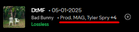

# Spicetify Extensions by gaprj

A collection of custom extensions for Spicetify to enhance your Spotify experience.

---

## Queued Tracks Time

Spicetify extension that shows **only** the duration of manually queued tracks in Spotify's queue, excluding playlist autoplay.

### Features
- Shows time remaining for manually queued tracks only
- Excludes playlist/album autoplay from calculation
- Clean and minimal display
- Updates in real-time

### Preview


### Installation

#### Via Marketplace (Recommended)
1. Open Spotify with Spicetify installed
2. Go to the Marketplace
3. Search for "Queued Tracks Time"
4. Click Install

#### Manual Installation
1. Download `queued-tracks-time.js` from the `queued-tracks-time` folder.
2. Copy to your Spicetify Extensions folder:
   - Windows: `%appdata%\spicetify\Extensions` or `%localappdata%\spicetify\Extensions`
   - Linux/Mac: `~/.config/spicetify/Extensions`
3. Run:
   ```bash
   spicetify config extensions queued-tracks-time/queued-tracks-time.js
   spicetify apply
   ```

### Credits
Based on the [original QueueTime extension](https://github.com/Theblockbuster1/spicetify-extensions/tree/main/QueueTime) by [Theblockbuster1](https://github.com/Theblockbuster1). Modified to show only manually queued tracks duration, excluding playlist autoplay.

---

## Shuffle Queue

Safe Fisher-Yates shuffle for playlist context using native reordering to avoid queue duplication.

### Features
- True Shuffle: Perfectly random order using the Fisher-Yates algorithm.
- Native Reorder: Moves existing tracks instead of adding new ones, preventing duplicates.
- Anti-Crash UI: Uses a floating action button to avoid conflicts with Spotify's React engine.

### Preview


### Manual Installation
1. Download `shuffleQueue.js` from the `shuffleQueue` folder.
2. Copy to your Spicetify Extensions folder.
3. Run:
   ```bash
   spicetify config extensions shuffleQueue/shuffleQueue.js
   spicetify apply
   ```

---

## Track Producers

Displays the producer(s) of the currently playing track directly in the Now Playing bar.

### Features
- **Native Integration:** Blends seamlessly into Spotify's UI, appearing right next to the track artists.
- **Clickable Profiles:** Click on a producer's name to instantly open their Spotify artist page using the internal router.
- **Clean Layout:** Displays a maximum of two producers inline.
- **Expanded Credits Modal:** If a track has more than two producers, a clickable `+X` button opens a native Spicetify modal containing the full list.

### Preview


### Manual Installation
1. Download `track-producers.js` from the `trackProducers` folder.
2. Copy to your Spicetify Extensions folder.
3. Run:
   ```bash
   spicetify config extensions trackProducers/track-producers.js
   spicetify apply
   ```

---

## Clone Playlist

Clone any Spotify playlist via right-click, copying all tracks, description, and cover art.

### Manual Installation
1. Download `clonePlaylists.js` from the `clonePlaylists` folder.
2. Copy to your Spicetify Extensions folder.
3. Run:
   ```bash
   spicetify config extensions clonePlaylists/clonePlaylists.js
   spicetify apply
   ```

---

## License
MIT License
