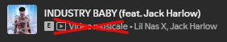

# Remove Video Tag

Completely removes the "Music Video" indicator, its button, and separator from the Now Playing bar, Queue, and Search results for a cleaner UI.

## Features
- Dynamically hides the music video badge and button globally across the Spotify client.
- Cleans up leftover dot separators (`•`) and invisible wrapper margins to maintain perfect artist text alignment.
- Automatically supports both English and Italian localizations.

## Preview


## Installation

### Manual Installation
1. Download `RemoveVideoTag.js` from the `RemoveVideoTag` folder.
2. Copy to your Spicetify Extensions folder:
   - Windows: `%appdata%\spicetify\Extensions` or `%localappdata%\spicetify\Extensions`
   - Linux/Mac: `~/.config/spicetify/Extensions`
3. Run:
   ```bash
   spicetify config extensions RemoveVideoTag/RemoveVideoTag.js
   spicetify apply
   ```
